# FitApp - Fitness Tracking Android App

FitApp is an Android App that will serve as a fitness tracker with a social media
component for fitness enthusiasts who want to monitor and share their fitness experience.

_Run in Android Studio for best experience_

## Core Features

- Add a routine with workouts containing exercises
- Start a workout and keep track of progress
- Document previous workouts in a workout log

## Screenshots

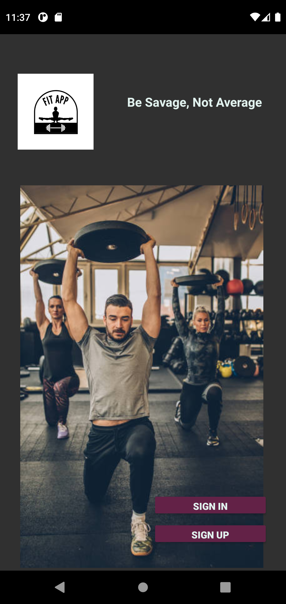 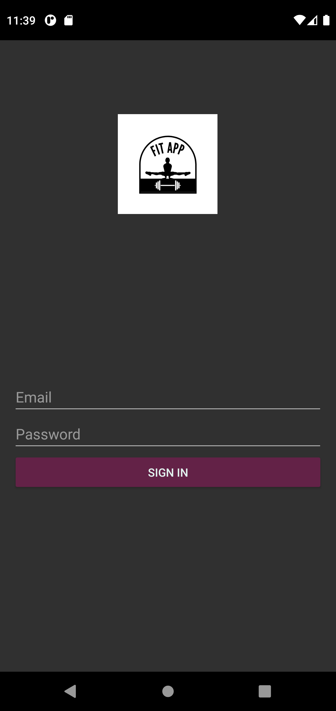

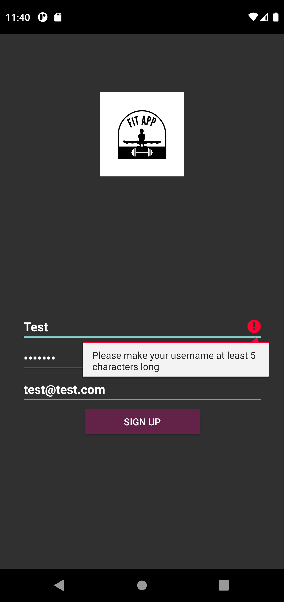 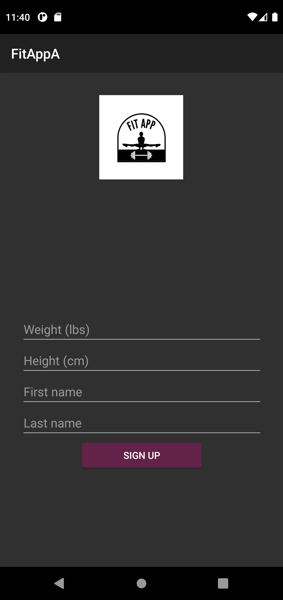

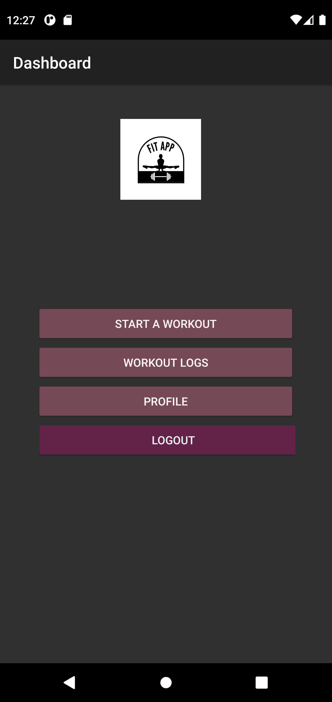  

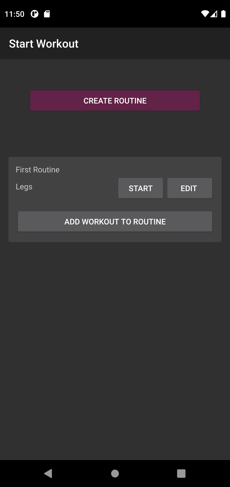 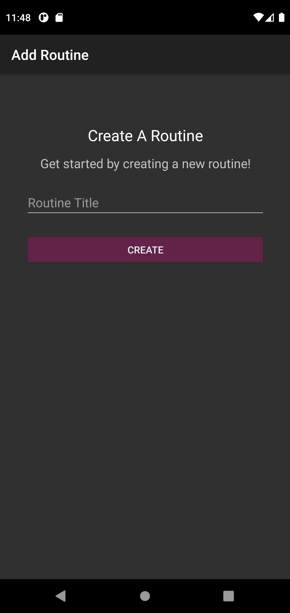

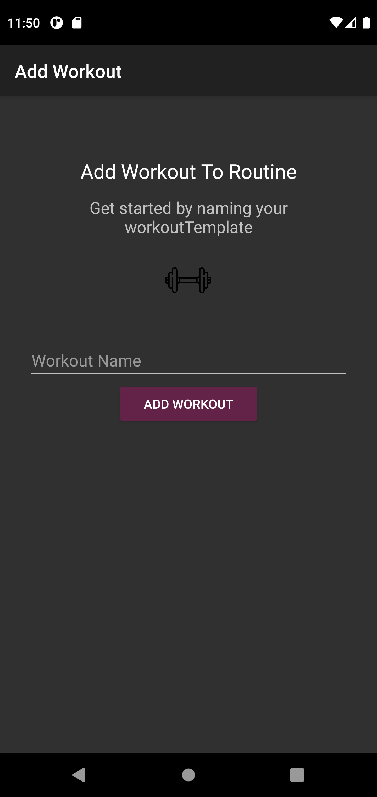 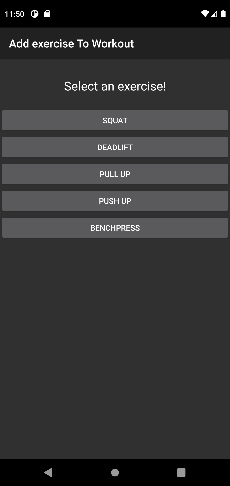

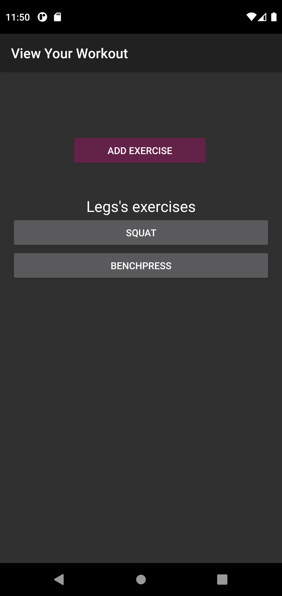 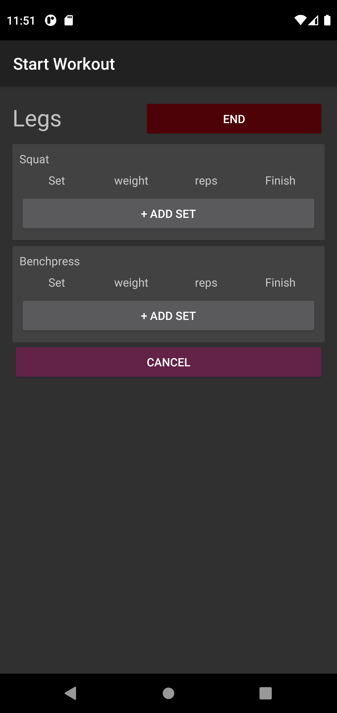 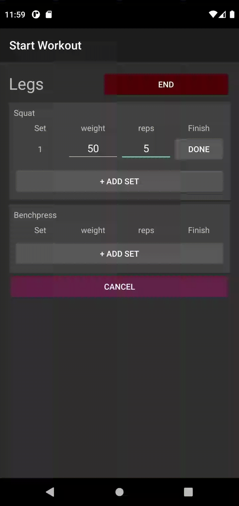
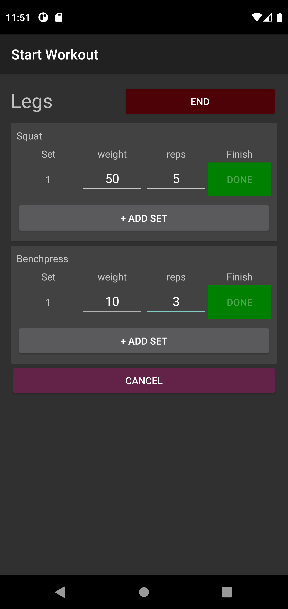 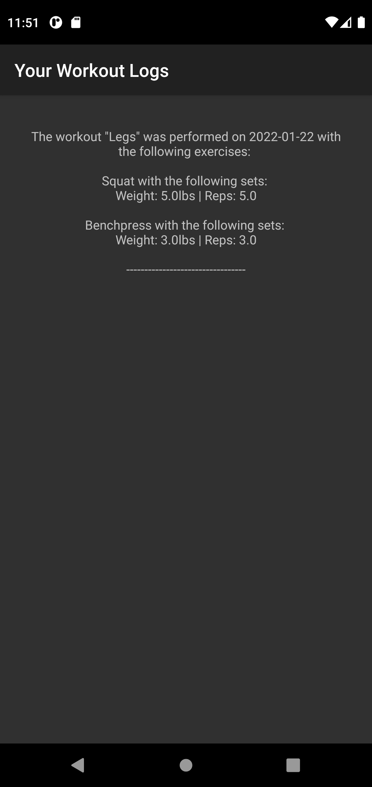
